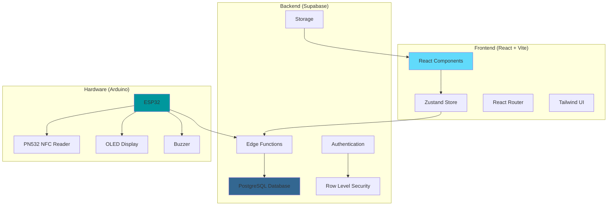

# 🏢 Website Manajemen Aset dengan Integrasi NFC dan Arduino

<div align="center">


*Sistem manajemen aset modern dengan integrasi NFC dan Arduino untuk tracking real-time*

</div>

## 📋 Daftar Isi

- [Tentang Proyek](#-tentang-proyek)
- [Fitur Utama](#-fitur-utama)
- [Tech Stack](#-tech-stack)
- [Arsitektur Sistem](#-arsitektur-sistem)
- [Database Schema](#-database-schema)
- [Instalasi](#-instalasi)
- [Konfigurasi](#-konfigurasi)
- [Penggunaan](#-penggunaan)
- [Hardware Setup](#-hardware-setup)
- [API Documentation](#-api-documentation)
- [Deployment](#-deployment)
- [Kontribusi](#-kontribusi)
- [Lisensi](#-lisensi)

## 🎯 Tentang Proyek

Website Manajemen Aset adalah sistem komprehensif yang dirancang untuk mengelola inventaris aset organisasi dengan teknologi modern. Sistem ini mengintegrasikan pembacaan NFC tag melalui Arduino untuk tracking aset secara real-time, dilengkapi dengan sistem role-based access control (RBAC) yang granular.

### 🌟 Keunggulan

- **Real-time Asset Tracking** dengan teknologi NFC
- **Multi-level Access Control** (Admin, Ketua Bidang, Staf)
- **Responsive Design** untuk desktop dan mobile
- **Offline Capability** pada perangkat Arduino
- **Advanced Filtering** dan pencarian
- **Import/Export** data Excel dan PDF
- **Dark/Light Mode** dengan preferensi tersimpan
- **Audit Trail** untuk semua aktivitas

## 🚀 Fitur Utama

### 1. 🔐 Sistem Autentikasi & Otorisasi

#### Multi-Level Access Control
- **👑 Admin**: Akses penuh ke semua fitur dan data
- **👨‍💼 Ketua Bidang**: Read & Export untuk departemen yang dikelola
- **👤 Staf**: Read terbatas pada kategori yang dikelola

#### Granular Permissions
- Pengaturan akses per departemen dan kategori
- Support multiple roles per user
- Row Level Security (RLS) di database level

### 2. 📊 Dashboard & Analytics

- **Real-time Statistics** nilai aset dan jumlah
- **Interactive Charts** untuk trend analysis
- **Recent Activity** tracking
- **Department-wise Breakdown** dengan visualisasi

### 3. 📦 Manajemen Aset

#### Struktur Kategori
```
📁 Sekretariat
├── 📄 Aset Tetap
└── 📄 Inventaris Aset

📁 Bidang Pendidikan
├── 🎓 TKI (Taman Kanak-kanak Islam)
├── 🏫 SDI (Sekolah Dasar Islam)
├── 📚 TPA (Taman Pendidikan Al-Quran)
└── 🕌 Madrasah

📁 Bidang Sosial Kemasyarakatan
├── 👥 AYD (Anak, Remaja, dan Pemuda)
├── 🧑‍🤝‍🧑 Remaja
└── ⚰️ Muamalah dan Kematian

📁 Bidang Kemakmuran Masjid
└── 🕌 (Tanpa subkategori)

📁 Bidang ICT
└── 💻 (Tanpa subkategori)
```

#### Fitur Aset
- **CRUD Operations** dengan validasi
- **Image Upload** dengan Supabase Storage
- **Depreciation Calculation** otomatis
- **Asset Numbering** dengan format standar
- **QR Code/NFC Integration**

### 4. 📱 NFC Integration

- **Real-time Scanning** dengan Arduino ESP32
- **Offline Storage** saat tidak ada koneksi
- **Auto Sync** ketika online kembali
- **Scan History** dengan timestamp
- **Device Tracking** berdasarkan MAC address

### 5. 📈 Import/Export

#### Import Features
- **Excel Import** dengan template validation
- **Bulk Upload** dengan progress tracking
- **Error Handling** dan reporting
- **Data Validation** sebelum insert

#### Export Features
- **Excel Export** dengan formatting
- **PDF Reports** dengan custom layout
- **Filtered Export** berdasarkan kriteria
- **Scheduled Reports** (future feature)

### 6. 🎨 User Experience

- **Floating Sidebar** dengan expand/collapse
- **Dark/Light Mode** dengan system preference
- **Responsive Design** untuk semua device
- **Loading States** dan error handling
- **Toast Notifications** untuk feedback

## 🛠 Tech Stack

### Frontend
| Technology | Version | Purpose |
|------------|---------|---------|
| **React** | 18.3.1 | UI Library untuk component-based development |
| **TypeScript** | 5.5.3 | Type safety dan better developer experience |
| **Vite** | 5.4.2 | Build tool yang cepat dengan HMR |
| **Tailwind CSS** | 3.4.1 | Utility-first CSS framework |
| **Framer Motion** | 12.4.3 | Animation library untuk smooth transitions |
| **React Router** | 6.22.2 | Client-side routing |
| **Zustand** | 4.5.2 | State management yang lightweight |
| **Lucide React** | 0.344.0 | Icon library yang konsisten |

### Backend & Database
| Technology | Purpose |
|------------|---------|
| **Supabase** | Backend-as-a-Service dengan PostgreSQL |
| **PostgreSQL** | Relational database dengan JSON support |
| **Row Level Security** | Database-level authorization |
| **Edge Functions** | Serverless functions untuk API |
| **Supabase Auth** | Authentication dengan JWT |
| **Supabase Storage** | File storage untuk images |

### Data Processing
| Library | Version | Purpose |
|---------|---------|---------|
| **Chart.js** | 4.4.7 | Data visualization dan charts |
| **React ChartJS 2** | 5.3.0 | React wrapper untuk Chart.js |
| **jsPDF** | 2.5.2 | PDF generation |
| **jsPDF AutoTable** | 3.8.4 | Table formatting untuk PDF |
| **XLSX** | 0.18.5 | Excel file processing |
| **date-fns** | 4.1.0 | Date manipulation utilities |

### Hardware Integration
| Component | Model | Purpose |
|-----------|-------|---------|
| **Microcontroller** | ESP32 | WiFi-enabled processing unit |
| **NFC Reader** | PN532 | NFC tag reading via SPI |
| **Display** | OLED 0.96" | Status dan feedback display |
| **Buzzer** | Passive | Audio feedback untuk scanning |

### Development Tools
| Tool | Purpose |
|------|---------|
| **ESLint** | Code linting dan style enforcement |
| **TypeScript ESLint** | TypeScript-specific linting rules |
| **PostCSS** | CSS processing dengan Tailwind |
| **Autoprefixer** | CSS vendor prefixing |

## 🏗 Arsitektur Sistem



### Data Flow

1. **User Authentication**: Supabase Auth → JWT Token → RLS Policies
2. **Asset Management**: React Components → Zustand Store → Supabase API → PostgreSQL
3. **NFC Scanning**: Arduino → Edge Function → Database → Real-time Updates
4. **File Operations**: Upload → Supabase Storage → Database Reference

## 🗄 Database Schema

### Core Tables

#### `assets`
```sql
CREATE TABLE assets (
  id uuid PRIMARY KEY DEFAULT gen_random_uuid(),
  nfc_uid text UNIQUE,
  asset_number text UNIQUE NOT NULL,
  sequential_number text,
  year integer NOT NULL,
  name text NOT NULL,
  brand text,
  acquisition_value numeric NOT NULL DEFAULT 0,
  book_value numeric NOT NULL DEFAULT 0,
  department text NOT NULL,
  category text,
  depreciation_group_id uuid REFERENCES asset_depreciation_groups(id),
  image_url text,
  purchase_date timestamptz DEFAULT now(),
  created_at timestamptz DEFAULT now(),
  updated_at timestamptz DEFAULT now()
);
```

#### `asset_scan_history`
```sql
CREATE TABLE asset_scan_history (
  id uuid PRIMARY KEY DEFAULT gen_random_uuid(),
  asset_id uuid REFERENCES assets(id) ON DELETE CASCADE,
  scanned_at timestamptz DEFAULT now(),
  device_id text,
  created_at timestamptz DEFAULT now()
);
```

#### `roles` & `user_roles`
```sql
CREATE TABLE roles (
  id uuid PRIMARY KEY DEFAULT gen_random_uuid(),
  name text UNIQUE NOT NULL,
  description text,
  created_at timestamptz DEFAULT now()
);

CREATE TABLE user_roles (
  id uuid PRIMARY KEY DEFAULT gen_random_uuid(),
  user_id uuid REFERENCES auth.users(id) ON DELETE CASCADE,
  role_id uuid REFERENCES roles(id) ON DELETE CASCADE,
  created_at timestamptz DEFAULT now(),
  UNIQUE(user_id, role_id)
);
```

### Security Policies

```sql
-- Admin dapat akses semua data
CREATE POLICY "Admin full access" ON assets
  FOR ALL TO authenticated
  USING (is_admin(auth.uid()));

-- Ketua bidang dapat read departemen mereka
CREATE POLICY "Department head read access" ON assets
  FOR SELECT TO authenticated
  USING (has_department_access(auth.uid(), department, 'head'));
```

## 📥 Instalasi

### Prerequisites

- **Node.js** >= 18.0.0
- **npm** atau **yarn**
- **Git**
- **Supabase Account**
- **Arduino IDE** (untuk hardware)

### 1. Clone Repository

```bash
git clone https://github.com/your-username/asset-management-system.git
cd asset-management-system
```

### 2. Install Dependencies

```bash
npm install
# atau
yarn install
```

### 3. Environment Setup

Buat file `.env` di root project:

```env
VITE_SUPABASE_URL=https://your-project.supabase.co
VITE_SUPABASE_ANON_KEY=your-anon-key
```

### 4. Database Setup

1. **Buat Supabase Project**
2. **Jalankan Migrations**:
   ```bash
   # Jika menggunakan Supabase CLI
   supabase db push
   
   # Atau copy-paste SQL dari folder migrations ke SQL Editor
   ```

3. **Setup Storage Bucket**:
   ```sql
   INSERT INTO storage.buckets (id, name, public) 
   VALUES ('asset-images', 'asset-images', true);
   ```

### 5. Jalankan Development Server

```bash
npm run dev
# atau
yarn dev
```

Aplikasi akan tersedia di `http://localhost:5173`

## ⚙️ Konfigurasi

### Supabase Configuration

#### 1. Authentication Settings
- Enable email authentication
- Disable email confirmation (atau sesuaikan kebutuhan)
- Setup redirect URLs untuk production

#### 2. Database Policies
Pastikan RLS enabled untuk semua tabel:
```sql
ALTER TABLE assets ENABLE ROW LEVEL SECURITY;
ALTER TABLE asset_scan_history ENABLE ROW LEVEL SECURITY;
-- dst...
```

#### 3. Edge Functions
Deploy function untuk NFC scanning:
```bash
supabase functions deploy handle-nfc-scan
```

### Environment Variables

| Variable | Description | Example |
|----------|-------------|---------|
| `VITE_SUPABASE_URL` | Supabase project URL | `https://xxx.supabase.co` |
| `VITE_SUPABASE_ANON_KEY` | Public anon key | `eyJhbGciOiJIUzI1NiIs...` |

## 📖 Penggunaan

### 1. Login & Setup

1. **Akses aplikasi** di browser
2. **Register/Login** dengan email
3. **Admin setup**: Assign role admin ke user pertama

### 2. Manajemen User & Role

```typescript
// Contoh assign role via Settings page
const assignRole = async (userEmail: string, roleId: string) => {
  await supabase.rpc('assign_user_role', {
    user_email: userEmail,
    role_id: roleId
  });
};
```

### 3. Menambah Asset

1. **Klik "Add New"** di halaman Assets
2. **Isi form** dengan data lengkap
3. **Upload gambar** (opsional)
4. **Assign NFC UID** untuk tracking

### 4. Import Data

1. **Download template** Excel
2. **Isi data** sesuai format
3. **Upload file** via Import modal
4. **Review errors** jika ada
5. **Confirm import**

### 5. NFC Scanning

1. **Setup Arduino** dengan kode yang disediakan
2. **Scan NFC tag** pada aset
3. **Lihat history** di Dashboard
4. **Track real-time** activity

## 🔧 Hardware Setup

### Komponen yang Dibutuhkan

| Komponen | Spesifikasi | Harga Estimasi |
|----------|-------------|----------------|
| ESP32 DevKit | WiFi + Bluetooth | Rp 80.000 |
| PN532 NFC Module | 13.56MHz RFID/NFC | Rp 120.000 |
| OLED Display | 0.96" I2C SSD1306 | Rp 35.000 |
| Buzzer | Passive 5V | Rp 5.000 |
| Breadboard + Jumper | Prototyping | Rp 25.000 |
| **Total** | | **Rp 265.000** |

### Wiring Diagram

```
ESP32 Pinout:
┌─────────────────┐
│     ESP32       │
│                 │
│ GPIO 21 ──────── SDA (OLED)
│ GPIO 22 ──────── SCL (OLED)
│                 │
│ GPIO 18 ──────── SCK (PN532)
│ GPIO 19 ──────── MISO (PN532)
│ GPIO 23 ──────── MOSI (PN532)
│ GPIO 5  ──────── SS (PN532)
│                 │
│ GPIO 13 ──────── Buzzer (+)
│ GND     ──────── Buzzer (-)
│                 │
│ 3.3V    ──────── VCC (All modules)
│ GND     ──────── GND (All modules)
└─────────────────┘
```

### Arduino Code Setup

1. **Install Libraries**:
   ```cpp
   // Library Manager → Install:
   - Adafruit PN532
   - U8g2
   - ArduinoJson
   - WiFi (built-in)
   ```

2. **Update Configuration**:
   ```cpp
   // WiFi credentials
   wifiMulti.addAP("Your-WiFi-SSID", "Your-Password");
   
   // API endpoint
   #define API_ENDPOINT "https://your-project.supabase.co/functions/v1/handle-nfc-scan"
   #define API_KEY "your-supabase-anon-key"
   ```

3. **Upload Code** ke ESP32

### Testing Hardware

```cpp
void testComponents() {
  // Test OLED
  u8g2.clearBuffer();
  u8g2.drawStr(0, 15, "OLED OK");
  u8g2.sendBuffer();
  
  // Test Buzzer
  beep(200);
  
  // Test NFC
  uint32_t versiondata = nfc.getFirmwareVersion();
  if (versiondata) {
    Serial.println("PN532 OK");
  }
  
  // Test WiFi
  if (WiFi.status() == WL_CONNECTED) {
    Serial.println("WiFi OK");
  }
}
```

## 📚 API Documentation

### Edge Functions

#### `handle-nfc-scan`

**Endpoint**: `POST /functions/v1/handle-nfc-scan`

**Request Body**:
```json
{
  "tag_id": "04:52:F6:73:80:00:00",
  "scanned_at": "2024-01-15T10:30:00Z",
  "device_id": "AA:BB:CC:DD:EE:FF"
}
```

**Response Success** (200):
```json
{
  "message": "Scan recorded successfully",
  "asset": {
    "id": "uuid",
    "name": "Laptop Dell XPS",
    "asset_number": "ST24A0010001"
  }
}
```

**Response Error** (404):
```json
{
  "error": "Asset not found for this NFC tag"
}
```

### Database Functions

#### `is_admin(user_id)`
```sql
CREATE OR REPLACE FUNCTION is_admin(user_id uuid)
RETURNS boolean AS $$
BEGIN
  RETURN EXISTS (
    SELECT 1 FROM user_roles ur
    JOIN roles r ON ur.role_id = r.id
    WHERE ur.user_id = $1 AND r.name = 'admin'
  );
END;
$$ LANGUAGE plpgsql SECURITY DEFINER;
```

#### `has_department_access(user_id, department, level)`
```sql
CREATE OR REPLACE FUNCTION has_department_access(
  user_id uuid, 
  dept text, 
  access_level text
)
RETURNS boolean AS $$
BEGIN
  -- Implementation untuk check department access
  RETURN EXISTS (
    SELECT 1 FROM department_access da
    JOIN user_roles ur ON da.role_id = ur.role_id
    WHERE ur.user_id = $1 
    AND da.department = $2 
    AND da.access_level = $3
  );
END;
$$ LANGUAGE plpgsql SECURITY DEFINER;
```

## 🚀 Deployment

### Frontend Deployment (Netlify)

1. **Build Project**:
   ```bash
   npm run build
   ```

2. **Deploy ke Netlify**:
   ```bash
   # Install Netlify CLI
   npm install -g netlify-cli
   
   # Deploy
   netlify deploy --prod --dir=dist
   ```

3. **Environment Variables**:
   - Set `VITE_SUPABASE_URL` dan `VITE_SUPABASE_ANON_KEY` di Netlify dashboard

### Supabase Deployment

1. **Production Database**:
   - Upgrade ke paid plan jika diperlukan
   - Setup backup schedule
   - Configure custom domain

2. **Edge Functions**:
   ```bash
   supabase functions deploy --project-ref your-project-ref
   ```

3. **Storage Configuration**:
   ```sql
   -- Setup storage policies
   CREATE POLICY "Public read access" ON storage.objects
   FOR SELECT USING (bucket_id = 'asset-images');
   ```

### Hardware Deployment

1. **Production Arduino Code**:
   - Update WiFi credentials untuk production
   - Set production API endpoints
   - Enable error logging

2. **Device Management**:
   - Label setiap device dengan unique ID
   - Setup monitoring untuk device status
   - Create maintenance schedule

## 🤝 Kontribusi

Kami menyambut kontribusi dari komunitas! Berikut cara berkontribusi:

### Development Workflow

1. **Fork repository**
2. **Create feature branch**:
   ```bash
   git checkout -b feature/amazing-feature
   ```
3. **Commit changes**:
   ```bash
   git commit -m 'Add amazing feature'
   ```
4. **Push to branch**:
   ```bash
   git push origin feature/amazing-feature
   ```
5. **Open Pull Request**

### Coding Standards

- **TypeScript**: Gunakan strict mode
- **ESLint**: Follow configured rules
- **Prettier**: Auto-format code
- **Commit Messages**: Follow conventional commits

### Testing

```bash
# Run tests
npm test

# Run linting
npm run lint

# Type checking
npm run type-check
```

## 📄 Lisensi

Proyek ini dilisensikan di bawah [MIT License](LICENSE).

```
MIT License

Copyright (c) 2024 Asset Management System

Permission is hereby granted, free of charge, to any person obtaining a copy
of this software and associated documentation files (the "Software"), to deal
in the Software without restriction, including without limitation the rights
to use, copy, modify, merge, publish, distribute, sublicense, and/or sell
copies of the Software, and to permit persons to whom the Software is
furnished to do so, subject to the following conditions:

The above copyright notice and this permission notice shall be included in all
copies or substantial portions of the Software.

THE SOFTWARE IS PROVIDED "AS IS", WITHOUT WARRANTY OF ANY KIND, EXPRESS OR
IMPLIED, INCLUDING BUT NOT LIMITED TO THE WARRANTIES OF MERCHANTABILITY,
FITNESS FOR A PARTICULAR PURPOSE AND NONINFRINGEMENT. IN NO EVENT SHALL THE
AUTHORS OR COPYRIGHT HOLDERS BE LIABLE FOR ANY CLAIM, DAMAGES OR OTHER
LIABILITY, WHETHER IN AN ACTION OF CONTRACT, TORT OR OTHERWISE, ARISING FROM,
OUT OF OR IN CONNECTION WITH THE SOFTWARE OR THE USE OR OTHER DEALINGS IN THE
SOFTWARE.
```

---

## 📞 Support & Contact

- **Email**: support@assetmanagement.com
- **Documentation**: [Wiki](https://github.com/your-repo/wiki)
- **Issues**: [GitHub Issues](https://github.com/your-repo/issues)
- **Discussions**: [GitHub Discussions](https://github.com/your-repo/discussions)

---

<div align="center">

**⭐ Jika proyek ini membantu, berikan star di GitHub! ⭐**

Made with ❤️ by [Your Team Name]

</div>